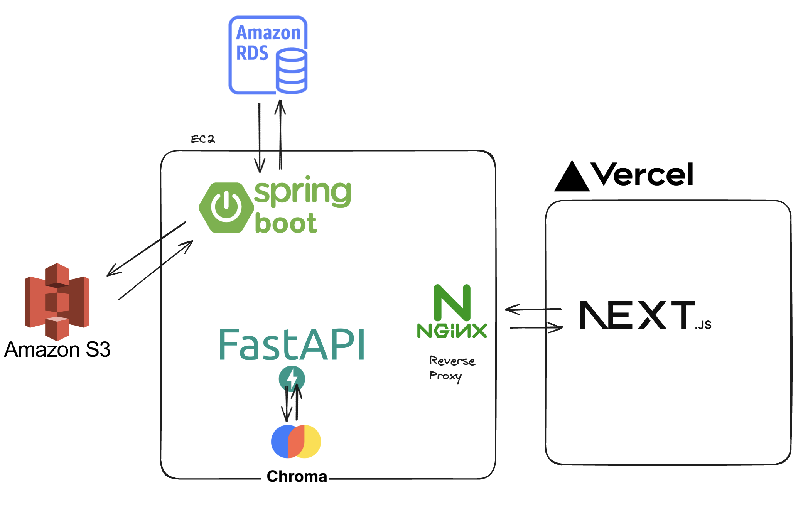

## 💡 서비스 개요
Hiro, we are hiring! 하이로는 채용담당관의 요구사항을 기반으로 적합한 이력서를 추천해주는 서비스입니다.
많은 이력서들 중에 채용 담당관이 원하는 이력서를 더 쉽고 빠르게 찾을 수 있도록 돕고자 만들었습니다. 

## 🕹️ 배경
수많은 이력서들 중 채용담당관이 원하는 인재를 찾는 일은 쉽지 않습니다.
한 사람이 정성들여 확인할 수 있는 정보에는 한계가 있기 마련입니다.
이러한 한계를 극복하고자 하이로는 PDF형식의 이력서들을 업로드 시에 텍스트 형식으로 변환하여 저장하고, LLM을 사용하여 이력서들을 분석합니다.
분석한 정보를 기반으로 채용담당관이 물을만한 면접 질문들을 생성해주는 기능과 채용담당관의 요구사항에 맞는 이력서들을 추천해주는 기능을 가지고 있습니다.

## 💻 애플리케이션 소개
목적: 이력서에서 필요한 정보들을 저장 및 추출합니다.  
주요 기능:
- 이력서 업로드 시 LLM 기반 정형화 데이터 추출(이름, 경력, 언어, 기술스택 등)
- 이력서 기반 채용 담당관이 물을만한 질문(직군별, 컬쳐핏, 경험, 프로젝트 질문) 생성
- 채용 담당관의 요구사항(프롬프트)에 맞는 이력서들을 추천

## 발표 자료
[발표 자료](https://docs.google.com/presentation/d/1YEJUHT7qd9TRm_0dpPf1YWuKhcvVdodfl4fss5eO22M/edit?usp=sharing)

## 시연 영상

## 패치노트
**2024.11.25**
- [ ] API 이름 수정
    - 기존: /resumes-chat -> /recommend
    - 기존: /resumes/{resume_id}/interview -> /resumes/{resume_id}/generate-questions
    - 기존: /analyze -> /process-resume
- [ ] 벡터DB 이름 `chroma_wang` -> db

## API Specification
- [AI 명세](./docs/ai.md)
- [Backend 명세](./docs/backend.md)
- [Frontend 명세](./docs/frontend.md)

## 💎 개발자
### AI
|                                                 신은성                                                  |                                                  임요한                                                  |
| :-----------------------------------------------------------------------------------------------------: | :------------------------------------------------------------------------------------------------------: |
|  |  |
|                               [watanka](https://github.com/watanka)                               |                                  [obov](https://github.com/obov)                                  |

 

### Backend

|                                                 김영원                                                  |                                                  한상현                                                  |
| :-----------------------------------------------------------------------------------------------------: | :------------------------------------------------------------------------------------------------------: |
|  |  |
|                               [yw7148](https://github.com/yw7148)                               |                                  [Hansanghyun-github](https://github.com/Hansanghyun-github)                                  |

 

### Frontend

|                                                 장세영                                                  |                                                  옥채현                                                  |
| :-----------------------------------------------------------------------------------------------------: | :------------------------------------------------------------------------------------------------------: |
|  |  |
|                               [jangseyeong](https://github.com/jangseyeong)                               |                                  [okch0310](https://github.com/okch0310)                                  |

 

## 💻 Deployment
docker 컨테이너 형식으로 AWS EC2에 배포하였고, github action으로 CI/CD 파이프라인을 구현하였습니다.

## Author

See our [CODEOWNERS](./.github/CODEOWNERS) file.

## 📝 License
This project is MIT licensed.

