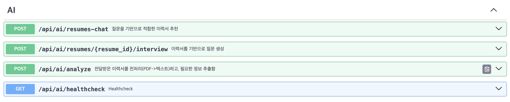

## 💡 Getting Started
```
sh build.sh
```

## 💡 API 명세
```
# FastAPI 앱 구동 후 동작
http://localhost:8000/docs
```

## 🛠 기술 스택
- **Framework:** FastAPI
- **Language:** Python 
- **LLM:** LangChain(model engine=OpenAI)
- **VectorDB:** Chroma

### 메인 기능

1. /recommend: **이력서 정보 추출 및 벡터DB에 저장**(input: PDF file, output: 벡터DB저장 정보)
2. /resumes/{resume_id}/generate-questions: **엠베딩 기반 질문 생성 기능**(input: 이력서 ID, output: 이력서 관련 생성 질문)
3. /recommend: **자연어 기반 벡터DB 쿼리 기능**(input: 프롬프트, output: list[이력서ID])


### TODO
- [ ] 테스트 기반으로 견고하게 동작하게 만들기
- [ ] 개선포인트를 찾고, evaluation 지표를 통해 개선하기

